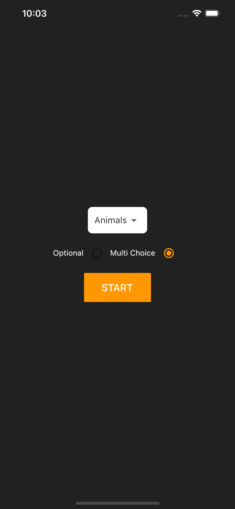
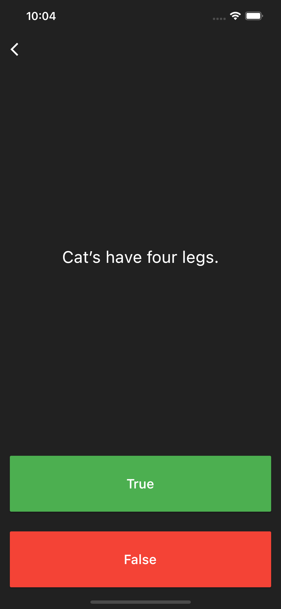
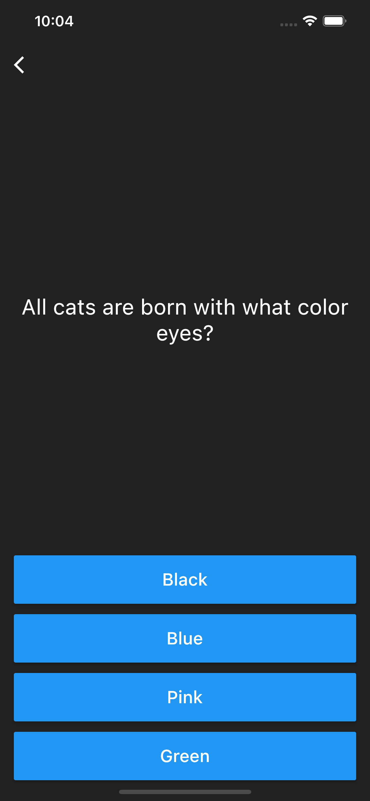
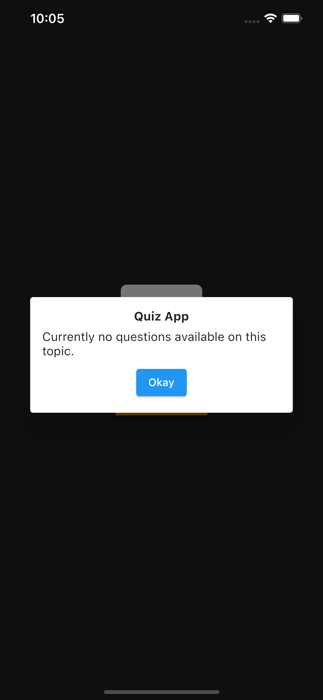
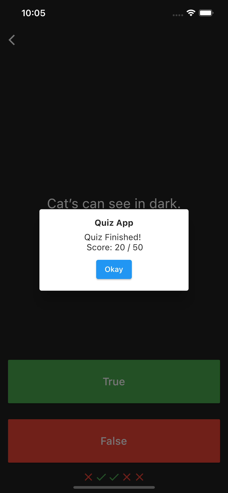
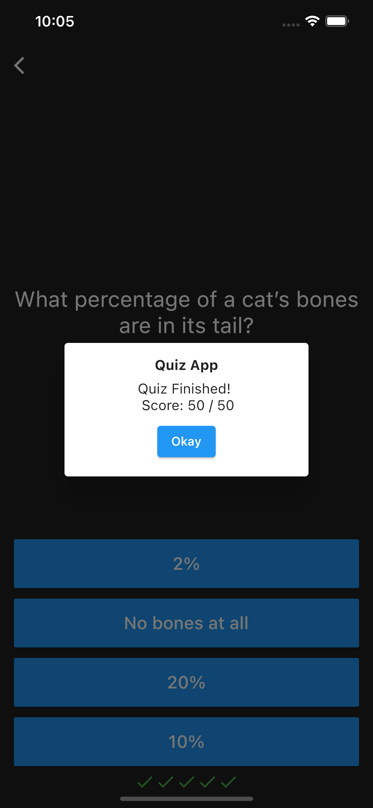

# Quiz App (GetX Version)

Quiz App, GetX Version of Quizler App

## ScreenShot

<a style='text-decoration: none; color: orange;'>
      
  

</a> <a style='text-decoration: none; color: orange;'>
      
  

</a> <a style='text-decoration: none; color: orange;'>
      
  

</a> <a style='text-decoration: none; color: orange;'>
      
  

</a> <a style='text-decoration: none; color: orange;'>
      
  

</a> <a style='text-decoration: none; color: orange;'>
      
  

</a>